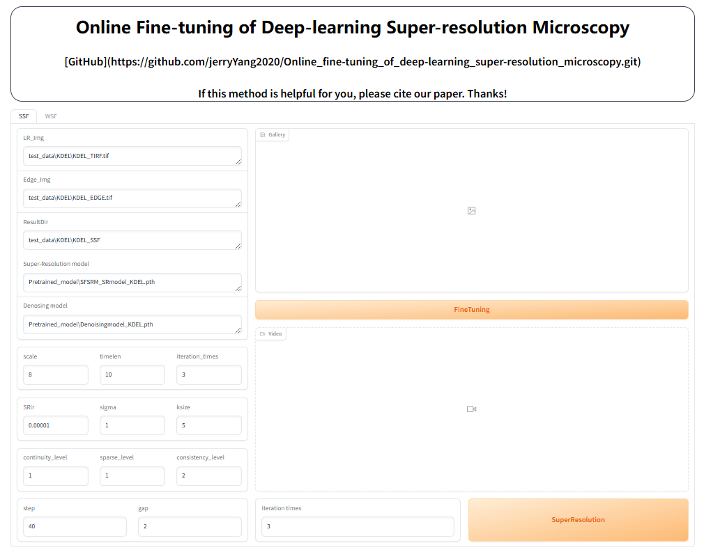

# Online fine-tuning of deep learning super-resolution microscopy for artifact suppression in live-cell imaging

## Introduction

Deep learning super-resolution microscopy (DSRM) is advancing rapidly in recent years. 
However, biologists are concerned about the potential imaging artifacts that may be generated by deep learning models. 
Although several methods have been developed to quantify artifacts, effective methods to suppress artifacts of DSRM are still lacking. 
To solve this problem, we propose an online fine-tuning (OFT) approach for DSRM that enables deep learning models to adjust their parameters
to minimize the loss function, which includes the quantification of artifacts from live-cell imaging. 
This allows microscopes to adapt intelligently to different imaging configurations, suppressing artifacts in practical applications of DSRM.

### Contributions 
We have developed two OFT methods: online fine-tuning via self-supervised fine-tuning (OFT-SSF) and online fine-tuning via weakly supervised fine-tuning (OFT-WSF), for different imaging applications:

 1.**OFT-SSF** utilizes low-resolution images as a reference for artifact suppression, 
based on a forward model of optical imaging. A denoising network and prior knowledge-based 
regularization terms are integrated to tackle the complex noise in live-cell imaging. 
OFT-SSF is designed for convenient, rapid daily use of super-resolution imaging 
and multicolor super-resolution imaging experiments.  

2.**OFT-WSF** utilizes live-cell single-molecule localization microscopy (SMLM) as a nano-scale 
reference for artifact suppression. The results of DSRM are compared with SMLM reconstructions 
to accurately quantify and suppress artifacts in live-cell imaging. OFT-WSF requires a customized 
experimental setup and is designed for experiments requiring high-precision artifact suppression. 


## Environment

- **CUDA**: 10.2.89
- **cudnn**: 8.6.0
- **Python**: 3.10.13
- **Pytorch**: 1.13.1+cu116
- **GPU**: GeForce RTX 3090
- **Dependencies**:  `requirements.txt`

## Install
1. Download the OnlineFinetuning_Demo.zip and unpack it. or clone this repository
   ```bash
   git clone https://github.com/yourusername/your-repository.git
   ```
   The directory tree should be:
   - `/options`: hyperparameter configuration files
   - `/Pretrained_model`: Pre-trained models
   - `/test_data`: test data
   - `/scripts`: scripts folder

2. Create and activate a virtual environment：
   ```bash
   conda create -n onlinefinetuning python=3.10.13
   conda activate onlinefinetuning
   ```

3. Install dependencies：
   ```bash
   pip install -r requirements.txt
   ```
## Pre-trained SFSRM models

In this paper, we combine online fine-tuning with a pre-trained SFSRM 
to suppress artifacts in super-resolution (SR) reconstructions across 
various imaging scenarios. For daily use scenarios and multicolor imaging 
experiments, the simpler **OFT-SSF** is recommended. 
For high-precision scenarios and experiments that need accurate quantification 
of artifacts, the **OFT-WSF**, which requires a customized blinking-nonblinking experimental setup, is recommended.
  
**SFSRM** was trained in the same manner as previously reported, to serve as the super-resolution network(SRN)
for OFT.We used fixed-cell data or simulated data as the training dataset, 
augmented by random cropping, rotation, and flipping.SFSRM took the concatenation of a 
low-resolution (LR) image and its edge map, which were reconstructed using the 
NanoJ-SRRF plugin in ImageJ, as a dual-channel input(Ring radius was set to 1 and axes in ring was set to 5). 
Pre-trained SFSRM models can be downloaded at the figshare repository (https://doi.org/10.6084/m9.figshare.26946601.v1).


## Fine-tuning steps
1. **Run run.py**：
   ```bash
   python run.py
   ```
   

2. **Copy the link and open the app in your browser**:
   

3. **Correctly configure parameters and start fine-tuning and super-resolution reconstruction procedures**：
   - **OFT-SSF/OFT-WSF**: Select the OFT mode.
   - **File**
      - `LR_Img`: datadir of the LR data for OFT-SSF/OFT-WSF
      - `Edge_Img`: datadir of the edgemap for SFSRM
      - `SMLM_Img`: datadir of the live-cell smlm for OFT-WSF
      - `ResultDir`: datadir for saving the results
      - `Super-Resolution model`: datadir of the pretrained SFSRM model
      - `Denosing model`: datadir of the pretrained denoising model
   - **Parameters**
      - `scale`: upsampling scale of the Super-resolution reconstructions
      - `timelen`: length of the random adjacent frames sequences (video)
      - `iteration_times`: iteration times of the OFT-SSF/OFT-WSF
      - `SRlr`: learning rate for the fine-tuning of SFSRM
      - `sigma`: Gaussian sigma of the RSF before upsampling
      - `ksize`: kernal size of the RSF
      - `continuity_level`: level of the continuity regularization term
      - `sparse_level`: level of the sparse regularization term
      - `consistency_level`: level of the consistency regularization term
      - `step`: step length for super-resolution reconstructions
      - `gap`: gap size for super-resolution reconstructions
   - **FineTuning**: Click the **FineTuning** button to perform OFT. The results of each iteration will be displayed.
   
   - **SuperResolution**: Select a satisfactory OFT iteration and click the SuperResolution button. The model corresponding to the selected iteration will be used to reconstruct super-resolution  video.
   


